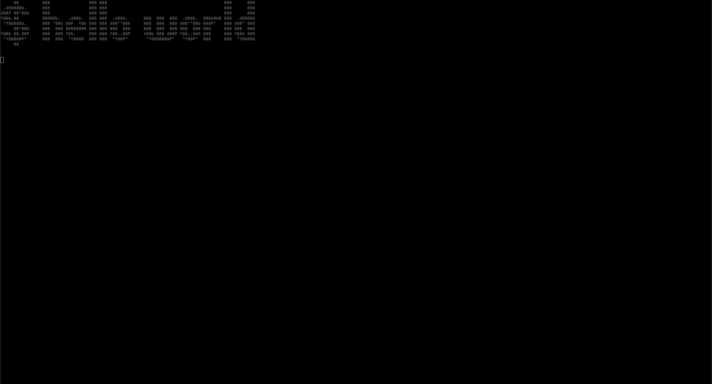

# Scream Shell

## Authorship

- I dedicate my part of this program to public domain by licensing the work with CC0, see the licensing file.
- [Spectre.Console](https://github.com/spectreconsole/spectre.console) prints a given text in ASCII art and is licensed under MIT.
- [Figlet](http://www.figlet.org/) gives the ASCII art for each letter. I didn't find info about its licensing unfortunately, let me know if you find anything.

